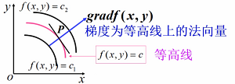
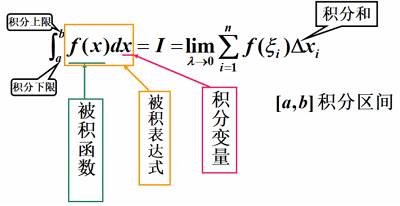
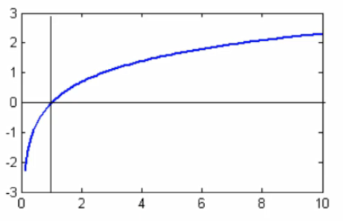

# 必备数学基础

### 函数

**函数的定义**：

- y = f(x) 其中x是自变量，y是因变量。y随着x变化

**几种特性**：

奇偶性、周期性、单调性（如下图）

**极限**：

- 按照一定次数排列的数：x1，x2，...，xn，其中xn叫做通项
- 对于数列｛xn｝,当n无限增大时，其通项无限接近于一个常数A，则称该数列以A为极限或称数列收敛于A。

**导数**：

- 都有对应的结果，不用死记硬背，查就行了，如(C)' = 0 或者(sin x)' = cos x

### 方向导数（引出梯度）

> 在函数定义域的内点，对某一*方向*求导得到的*导数*。
>
> 常规数学中，所有问题都有一个解。而机器学习当中，求解很难或者没有解，我们只能不断逼近这个最优解。

**问题一**：蚂蚁沿着什么方向跑路不被火烧，能活下来（二维平面）

> 蚂蚁沿着任意方向都可以活，最优的是沿着对角方向L，z是函数变化，也就是图中的φ。

**三维平面的方向导数公式**：

**求一个方向导数具体的值**：

### 梯度

> 是一个向量（矢量），表示某一函数在该点处的方向导数沿着该方向取得最大值，即函数在该点处沿着该方向（此*梯度*的方向）变化最快，变化率最大（为该*梯度*的模）。

> 根据上面的梯度导数，和方向导数的区别就在多了个*cosθ*，*θ*充当梯度和方向导数之间的关系

函数在某点的梯度是一个向量，它的方向与方向导数最大值取得的方向一致。

其大小正好是最大的方向导数

> 注意，只有*θ*=0，*cos*导数才能=1，梯度才能取得最大值，也就是那个方向。而沿着反方向就是最小值也就是梯度下降。

**求一个具体值，最大梯度方向和最小梯度方向**：

> 注：得出的结果(-1,0,2)，求解：((-1^2) + (0^2) + (-2^2)) = √5，前面都是x的平方，所以结果也需要开根号。

### 微积分

> 很多的微分积起来

如何求A面积的值

**以直代曲**：

- 对于矩形，我们可以轻松求得其面积，能否用矩形代替曲线形状呢？

- 应该用多少个矩形来代替？

> 越小的矩形，越覆盖，然后求每个矩形的面积。

$$
每个小矩形面积为：A_i=f(\xi
_i)\Delta x_i近似得到曲线面积：A\approx \sum^{n}_{i=1}f(\xi_i)\Delta x_i
$$

$$
当分割无限加细，每个小区间的最大长度为\lambda，此时\lambda → 0
$$

$$
曲边面积：A=lim_{\lambda→0}\sum^n_{i=1}f(\xi_i)\Delta x_i
$$

> 注意每个小区间的最大长度为λ，而λ无限接近于0时，那么曲边的面积我们就可以得出，当然这里的近似表达是极限，无限接近的极限。

**求和**：

我们需要尽可能的将每一个矩形的底边无穷小

莱布尼茨为了体现求和的感觉，把S拉长了，简写成

> 将上面的所有矩阵求和，∫ = sum，求和的意思

**定积分**:

当时，总和S总数趋于确定的极限l，则称极限l为函数f(x)在曲线[a,b]上的定积分

### 矩阵和特征

**矩阵**：

> 拿到数据后，数据就长如下样子，有行有列

> 左图√表示A可以到B和C，如右上图，再把√号改成0/1以存储在数据里面，就如右下图

**几种特别的矩阵**：

> 上三角部分有值，和下三角部分有值

> 对角阵：对角有值且可以是任意值，单位矩阵：对角有值且相同

> 同型矩阵：行列相同。矩阵相等：行列相同且里面的值一样

### SVD矩阵分解

数据行列可能很大，如电商行业100万客户（行），有1万的商品（特征），用一组数据表达就是

| 客户ID   | 商品1             | 商品2 | ...  | 商品1万 |
| -------- | ----------------- | ----- | ---- | ------- |
| xxx1     | 1（表示买过一次） | 0     | ...  | 5       |
| xxx2     | 0                 | 1     | ...  | 0       |
| ...      | 5                 | 10    | ...  | 0       |
| xxx100万 | ...               | ...   | ...  | ...     |

那么来一个客户，就是直接多1万列表示，这样的数据是非常稀疏的，我们可以分解成A表100万客户，100个特征，而这100个特征对应这那B表的1万个商品，也就是一个表变成A表和B表，且两者关联。

这就需要用到SVD矩阵。

### 离散和连续型数据

> 离散型是有限多个的，比如10个台阶，只可能是其中的一个台阶，一个确定的结果。
>
> 连续型则可能是任意的值，没办法确定是哪个台阶。

**离散型随机变量概率分布**

- 找到离散型随机变量X的所有可能取值

- 得到离散型随机变量取这些值的概率

  

  为离散型随机变量的概率函数

**连续型随机变量概率分布**

- 密度：一个物体，如果问其中一个点的质量是多少？这该怎么求？

  由于这个点实在太小了，那么质量就为0了，但是其中的一大块是由

  很多个点组成的，这时我们就可以根据密度来求其质量了

- X为连续随机变量，X在任意区间(a,b]上的概率可以表示为：

  其中f(x)就叫做X的概率密度函数，也可以简单叫做密度

> 还有一种方法是把每个值划分在不同区间，变成离散型，但如果有新数据进来就要再划分区间导致区间越来越多。

### 简单随机抽样

抽取的样本满足两点

1. 样本X1，X2...Xn是相互独立的随机变量。

2. 样本X1，X2...Xn与总体X同分布。

   

### 极大似然估计

> 找到最有可能的那个

1. $$
   构造似然函数：L(\theta)
   $$

   

2. $$
   对似然函数取对数：lnL(\theta)
   $$

   

3. $$
   求偏导：\frac {dlnL}{d\theta}=0
   $$

4. $$
   求解得到\theta值
   $$

   

> 第一步构造函数；第二步取对数，对数后的值容易取且极值点还是那个位置；第三步求偏导；得到θ

**求一个具体的值**：

设 X 服从参数 λ(λ>0) 的泊松分布，x1,x2,...,xn 是来自 X 的一个样本值，求λ的极大似然估计值

