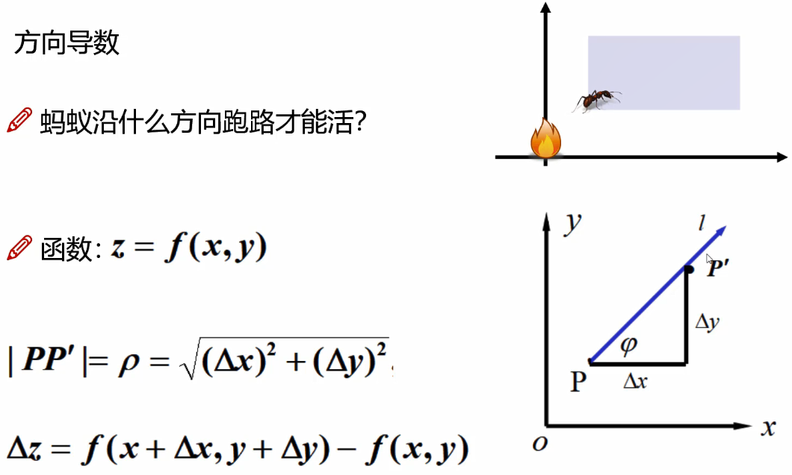

# 必备数学基础

### 高等数学基础

#### 函数

> **WHAT**:后面基本都是用函数，这里先理解一下函数的概念

**函数的定义**：

- y = f(x) 其中x是自变量，y是因变量。y随着x变化

**几种特性**：

奇偶性、周期性、单调性（如下图）

**极限**：

- 按照一定次数排列的数：x1，x2，...，xn，其中xn叫做通项
- 对于数列｛xn｝,当n无限增大时，其通项无限接近于一个常数A，则称该数列以A为极限或称数列收敛于A。

**导数**：

- 都有对应的结果，不用死记硬背，查就行了，如(C)' = 0 或者(sin x)' = cos x

#### 方向导数（引出梯度）

> 在函数定义域的内点，对某一*方向*求导得到的*导数*。
>
> 常规数学中，所有问题都有一个解。而机器学习当中，求解很难或者没有解，我们只能不断逼近这个最优解。

**问题一**：蚂蚁沿着什么方向跑路不被火烧，能活下来（二维平面）

> 蚂蚁沿着任意方向都可以活，最优的是沿着对角方向L，z是函数变化，也就是图中的φ。

**三维平面的方向导数公式**：

**求一个方向导数具体的值**：

求函数在点P(1,0)处，沿着从点P(1,0)到点Q(2,-1)的方向的方向导数。

所求方向导数

#### 梯度

> **WHAT**:简而言之，就是找到函数在某点沿着哪个梯度方向变化最大（小），也就是怎样的方向对数据逼近所需要的值最好。
>
> 是一个向量（矢量），表示某一函数在该点处的方向导数沿着该方向取得最大值，即函数在该点处沿着该方向（此*梯度*的方向）变化最快，变化率最大（为该*梯度*的模）。

函数：z = f(x,y)在平面域内具有连续的一阶偏导数，对于其中每个点P(x,y)都有向量则其称为函数点P的梯度。

是方向L上的单位向量

> 根据上面的梯度导数，和方向导数的区别就在多了个*cosθ*，*θ*充当梯度和方向导数之间的关系

只有当才有最大值

函数在某点的梯度是一个向量，它的方向与方向导数最大值取得的方向一致。

其大小正好是最大的方向导数

> 注意，只有*θ*=0，*cos*导数才能=1，梯度才能取得最大值，也就是那个方向。而沿着反方向就是最小值也就是梯度下降。

**求一个具体值，最大梯度方向和最小梯度方向**：

设求grad u，并求在点M(0,1,-1)处方向导数的最大（小）值

> 注：得出的结果(-1,0,2)，求解：((-1^2) + (0^2) + (-2^2)) = √5，前面都是x的平方，所以结果也需要开根号。

### 微积分

#### 微积分基本理论

> **WHAT**:前面说到，机器学习当中，求解很难或者没有解，而微积分也是一个用简单的方式，求一个与实际情况最接近的答案。
>
> 很多的微分积起来

如何求A面积的值

**以直代曲**：

- 对于矩形，我们可以轻松求得其面积，能否用矩形代替曲线形状呢？

- 应该用多少个矩形来代替？

> 越小的矩形，越覆盖，然后求每个矩形的面积。

**面积的由来**：

- 在ab之间插入若干个点，这样就得到n个小区间。
- 每个小矩形面积为：近似得到曲线面积
- 当分割无限加细，每个小区间的最大长度为λ，此时λ → 0
- 曲边面积：

> 注意每个小区间的最大长度为λ，而λ无限接近于0时，那么曲边的面积我们就可以得出，当然这里的近似表达是极限，无限接近的极限。

**求和**：

我们需要尽可能的将每一个矩形的底边无穷小

莱布尼茨为了体现求和的感觉，把S拉长了，简写成

> 将上面的所有矩阵求和，∫ = sum，求和的意思

**定积分**:

当时，总和S总数趋于确定的极限l，则称极限l为函数f(x)在曲线[a,b]上的定积分

### 泰勒公式

> **what**：用简单、熟悉的多项式来近似替代复杂的函数。
>
> 一个概念可以自己去找找，需要就找我，我再把内容加上

### 线性代数基础

#### 矩阵和特征

> **WHAT**：人工智能领域，数据基本是矩阵形式，而矩阵的每列（一般是除开首列），称为特征

**矩阵**：

> 拿到数据后，数据就长如下样子，有行有列

> 左图√表示A可以到B和C，如右上图，再把√号改成0/1以存储在数据里面，就如右下图

**几种特别的矩阵**：

> 上三角部分有值，和下三角部分有值

> 对角阵：对角有值且可以是任意值，单位矩阵：对角有值且相同

> 同型矩阵：行列相同。矩阵相等：行列相同且里面的值一样

#### 向量内积

- 设有n维向量：

- [x, y] = x1 y1 + x2 y2 + ... + xn yn，此时我们就把[x,y]叫做向量的内积。
- 
  - 对称性：[x, y] = [y, x]
  - 线性性质：[λx, y] = λ[x, y], [x + y, z] = [x, z] + [y, z]

#### SVD矩阵分解

> **WHAT**：为了让数据的呈现更好，且不破坏数据的原始表达

数据行列可能很大，如电商行业100万客户（行），有1万的商品（特征），用一组数据表达就是

| 客户ID   | 商品1             | 商品2 | ...  | 商品1万 |
| -------- | ----------------- | ----- | ---- | ------- |
| xxx1     | 1（表示买过一次） | 0     | ...  | 5       |
| xxx2     | 0                 | 1     | ...  | 0       |
| ...      | 5                 | 10    | ...  | 0       |
| xxx100万 | ...               | ...   | ...  | ...     |

那么来一个客户，就是直接多1万列表示，这样的数据是非常稀疏的，我们可以分解成A表100万客户，100个特征，而这100个特征对应这那B表的1万个商品，也就是一个表变成A表和B表，且两者关联。

这就需要用到SVD矩阵。

### 随机变量

#### 离散和连续型数据

> 离散型是有限多个的，比如10个台阶，只可能是其中的一个台阶，一个确定的结果。
>
> 连续型则可能是任意的值，没办法确定是哪个台阶。

**离散型随机变量概率分布**

- 找到离散型随机变量X的所有可能取值

- 得到离散型随机变量取这些值的概率

  

  为离散型随机变量的概率函数

**连续型随机变量概率分布**

- 密度：一个物体，如果问其中一个点的质量是多少？这该怎么求？

  由于这个点实在太小了，那么质量就为0了，但是其中的一大块是由

  很多个点组成的，这时我们就可以根据密度来求其质量了

- X为连续随机变量，X在任意区间(a,b]上的概率可以表示为：

  其中f(x)就叫做X的概率密度函数，也可以简单叫做密度

> 还有一种方法是把每个值划分在不同区间，变成离散型，但如果有新数据进来就要再划分区间导致区间越来越多。

#### 简单随机抽样

抽取的样本满足两点

1. 样本X1，X2...Xn是相互独立的随机变量。

2. 样本X1，X2...Xn与总体X同分布。

   

#### 极大似然估计

> **WHAT**：找到最有可能的结果

1. 构造似然函数：L(θ)

2. 对似然函数取对数：lnL(θ)

   > 做log后，logAB = logA + logB，加法更好求

3. 求偏导

4. 求解得到 θ 值

   

> 第一步构造函数；第二步取对数，对数后的值容易取且极值点还是那个位置；第三步求偏导；得到θ

**求一个具体的值**：

设 X 服从参数 λ(λ>0) 的泊松分布，x1,x2,...,xn 是来自 X 的一个样本值，求λ的极大似然估计值

- 因为X的分布律为
- 所以 λ 的似然函数为
- 
- 令
- 解得 λ 的极大似然估计值为 

### 概率论基础

#### 概率与频率

- 抛硬币和王者游戏击杀数，这些都是随机的
- 其特点：可以在相同条件下重复执行、事先知道可能出现的结果、开始前并不知道这一次的结果
- 随机试验E的所有结果构成的集合称为E的样本空间 S = {e}
  - 抛硬币：S = {正面，反面}
  - 击杀数：S = {0,1,2,...,n}

**频率与概率**

- A在这N次试验中发生的频率：，其中发生的次数(频数)；n—总试验次数。
- 的稳定值P定义为A的概率P(A) = p

- 次数越多则结果越稳定

#### 古典概型

- 定义：试验E中样本点是有限的，出现每一样本点的概率是相同。

  P(A) = A所包含的样本点数 / S中的样本点数

- 一袋中有8个球，编号为1 - 8，其中1 - 3号为红球，4 - 8 为黄球，设摸到每一球的可能性相等，从中随机摸一球，记A={摸到红球}，求P(A)。

  - S={1,2,...,8}
  - A={1,2,3} => P(A) = 3/8

#### 条件概率

> **WHAT**：在一定条件下的某个事件发生的概率

- 有个不放回的抽奖，一共三种可能性，两个不中奖一个中奖，也就是3个人抽奖，必有一个中奖，所有可能为{YNN, NYN, NNY}，N表示不中间，Y表示中间
- 第一名没中则：A = {NYN, NNY}，第三中的概率
- 