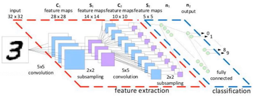
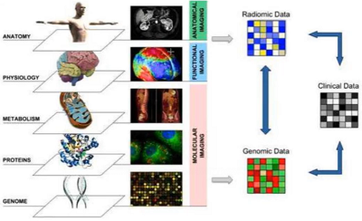

### 第一章 深度学习必备知识点

#### 深度学习要解决的问题

> 人工智能、机器学习、深度学习的区别于联系

机器学习的流程：

- 数据提取
- 特征工程
- 建立模型
- 评估与应用

> 特征工程可以说是建模过程中，最重要的部分。

既然特征工程是最重要的，常规我们会做各种各样的特征，如聚合统计、交叉等，那有没有一种方法，它可以**自动的**去选择重要的特征。

而深度学习可以说是最接近人工智能这一概念的，因为它解决了机器学习中“人工的”问题，如人工的选择特征、选择算法等。

深度学习最大的亮点，就是解决特征工程的人工问题。

特征工程的作用：

- 数据特征决定了模型的上限
- 预处理和特征提取是最核心的
- 算法与参数选择决定了如何逼近这个上限

特征如何提取，数值类的相对容易，那么文本类、图像类的呢？

传统特征提取方法：

> 各种计算可以说是非常麻烦的。

为什么需要深度学习：

> 如上图，将一个图像，分解成多个维度并变换成数值，变成机器可认识的。

#### 深度学习应用领域

自动驾驶：

人脸识别：

医学检测：

缺点：计算大量数据导致速度慢。

数据规模越大，越适合深度学习

#### 计算机视觉任务

如图像分类任务，如何把一张猫的图片，分到猫的类别（有一些列的标签：人、笔、飞机、猫 等等）

图像表示：计算机眼中的图像，一张图片被表示成三维数组的形式，每个像素的值从0到255。

> 可能的维度是`300*100*3`，假设高度h是300，宽度w是100，3则是颜色通道RBG。图像中数值越大表示该点越亮，反之则越暗。

**计算机视觉面临的挑战**：

还是上面这张图，如照射角度：

其形状可能改变成如下的样子：

或者部分遮蔽：

背景混入：

这些都是可能遇到得问题，如何解决可以给一些遮蔽的样本，这些都是数据量可以解决的。

