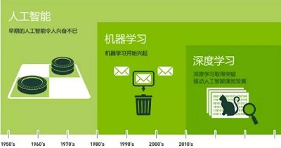
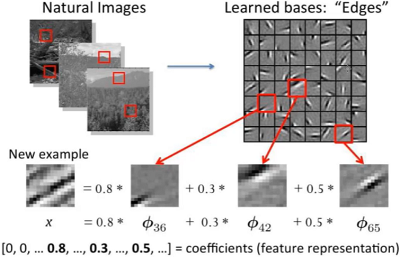
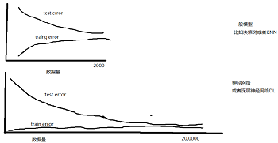
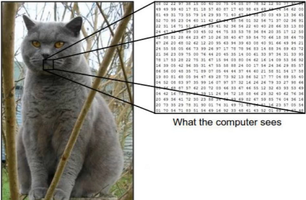
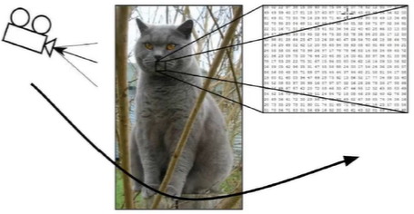
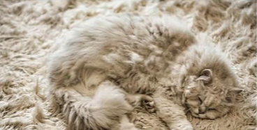
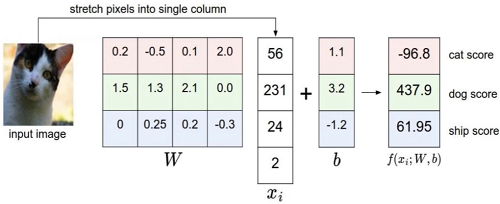
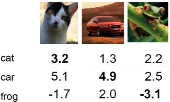

### 第一章——深度学习必备知识点

#### 深度学习要解决的问题

> 人工智能、机器学习、深度学习的区别于联系

机器学习的流程：

- 数据提取
- 特征工程
- 建立模型
- 评估与应用

> 特征工程可以说是建模过程中，最重要的部分。

既然特征工程是最重要的，常规我们会做各种各样的特征，如聚合统计、交叉等，那有没有一种方法，它可以**自动的**去选择重要的特征。

而深度学习可以说是最接近人工智能这一概念的，因为它解决了机器学习中“人工的”问题，如人工的选择特征、选择算法等。

深度学习最大的亮点，就是解决特征工程的人工问题。

特征工程的作用：

- 数据特征决定了模型的上限
- 预处理和特征提取是最核心的
- 算法与参数选择决定了如何逼近这个上限

特征如何提取，数值类的相对容易，那么文本类、图像类的呢？

传统特征提取方法：

> 各种计算可以说是非常麻烦的。

为什么需要深度学习：

> 如上图，将一个图像，分解成多个维度并变换成数值，变成机器可认识的。

#### 深度学习应用领域

自动驾驶：

人脸识别：

医学检测：

缺点：计算大量数据导致速度慢。

数据规模越大，越适合深度学习

#### 计算机视觉任务

如图像分类任务，如何把一张猫的图片，分到猫的类别（有一些列的标签：人、笔、飞机、猫 等等）

图像表示：计算机眼中的图像，一张图片被表示成三维数组的形式，每个像素的值从0到255。

> 可能的维度是`300*100*3`，假设高度h是300，宽度w是100，3则是颜色通道RBG。图像中数值越大表示该点越亮，反之则越暗。

**计算机视觉面临的挑战**：

还是上面这张图，如照射角度：

其形状可能改变成如下的样子：

或者部分遮蔽：

背景混入：

这些都是可能遇到得问题，如何解决可以给一些遮蔽的样本，这些都是数据量可以解决的。

#### 得分函数

线性函数

- 从输入——>输出的映射

  

  每个像素点对结果产生影响，而每个像素点有对应的权重。

- 数学表示

  

  `32*32*3`=3072个X（像素点），假设需要分类的类别一共有10个，那么这3072个X在这10个W（类别）中有着不同的权重得分，还有b偏值项，最终最高 得分 的就是预测的分类。

- 计算方法

  

  为了计算简单，假设这种猫只有4个像素点，分别是56、231、24、2，分成3个类别（猫、狗、船），其中W有3行对应3个类别，且Wi有4个值对应4个像素点，我们来计算第一行，`W*X+b = `0.2*56+(-0.5)*231+0.1*24+2.0*2+1.1`=-97.9+1.1=-96.8，这样就得到了结果。

  当权重Wi比较大时，说明该像素点对结果的影响比较重要，正值代表促进作用，负值代表抑制作用。

  - W矩阵怎么来的：一开始是假设了一个，然后根据结果不断优化，就想上面的预测是把猫预测成了狗437.9，那么神经网络会不断迭代W矩阵中的值。

  现在我们知道上面的结果不够好，那么我们应该怎样让它变好。

#### 损失函数

- 如何衡量分类的结果
- 怎么明确模型当前的效果是好是坏。

##### 其中一种损失函数（回归任务）：

实验：

假设我们运行完模型，得到上面这么个结果，第一张图评定为猫3.2为车5.1明显不合理，如果利用上面的公式，就是5.1-3.2=1.9，值越大表明预测越离谱，小于0则表示没有误差。

而+1是为了防止一种情况是，如果预测的car不是5.1而是3.15，那么3.15-3.2也小于0，但是能明确的说预测没问题吗？或许不能吧，因为只有一点偏差可能是“刚刚好”预测对了，那么+1就可以防止这种情况，预测对的值一定要远大于预测错的值。

计算：

cat = max(0, 5.1 - 3.2 + 1) + max(0, -1.7 - 3.2 + 1)

​      = max(0, 2.9) + max(0, -3.9)

​      = 2.9 + 0 = 2.9

> max(0, x)的意思是x大于0取x，小于0则取0

car = max(0, 1.3 - 4.9 + 1) + max(0, 2.0 - 4.9 + 1)

​      = max(0, -2.6) + max(0, -1.9)

​      = 0 + 0 = 0

frog = max(0, 2.2 - (-3.1) + 1) + max(0, 2.5 - (-3.1) + 1)

​      = max(0, 5.3) + max(0, 5.6)

​      = 5.3 + 5.6 = 10.9

其中car预测最好，frog的预测最差

损失函数的值相同，意味着两个模型一样吗？

- 还是这个公式：

- 输入数据：X = [1, 1, 1, 1]
  - 模型A：w1 = [1, 0, 0, 0]
  - 模型B：w2 = [0.25, 0.25, 0.25, 0.25]
- 两者的结果都等于1，那两者的可以说一样吗？，是不是模型B的W更可靠。那么损失函数还得加入一个东西

损失函数 = 数据损失 + 正则化惩罚项

- 正则化惩罚项：
- 正则化惩罚项关注权重w，w越大则该公式的结果越大，我们希望模型不要太复杂，过拟合的模型是没用的。往往还有个 λ 。

回归任务的解决了，还有分类任务的。

##### Softmax分类器（分类任务）

- 归一化：where

- 计算损失值：

举例：

> 其中3.2exp表示e^3.2=24.5，24.5normalize表示24.5 / (24.5+164+0.18) = 0.13，这就是概率，同时我们再做-log(0.13)可以得到0.89这个损失值，log(1)的时候为0，即没有损失，表示概率值越接近于1损失的越少。

这些都是前向传播，一步步的得到损失值，那么如何以损失值来更新W更新模型呢，这就是反向传播。